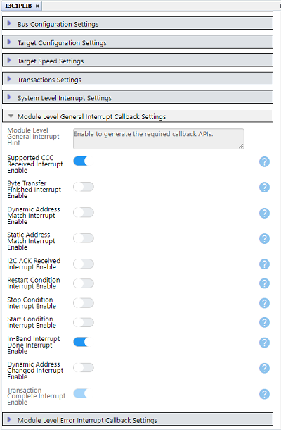
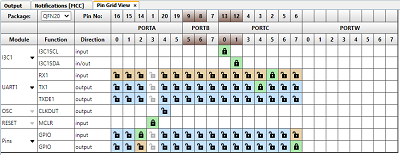
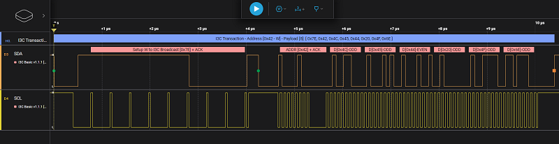

<!-- Please do not change this logo with link -->

# High Speed Data Transfer and In-Band Interrupts with I3C® using the PIC18F16Q20 Microcontroller and MCC Melody

This code example demonstrates how to set up the PIC18F16Q20 microcontroller as an I3C Target using MCC Melody.  The demonstration shows four types of I3C transactions:
- Broadcast Common Command Code (PIC18F16Q20 receives Dynamic Address Assignment)
- Direct Common Command Code (Controller sets the PIC18F16Q20's Maximum Write Length)
- Private Write (PIC18F16Q20 receives and responds to the message LED On/Off)
- In-Band Interrupt (PIC18F16Q20 generates an interrupt on the I3C bus)

The example demonstrates high speed data transfer (12.5 Mbps) and shows how the PIC18F16Q20 can take advantage of Direct Memory Access (DMA) to reliably move data to and from its I3C buffers without the CPU. 

## Related Documentation
For more details and code examples on the PIC18F16Q20 click on the following links:

- [PIC18F16Q20 Product Page](https://www.microchip.com/en-us/product/PIC18F16Q20?utm_source=GitHub&utm_medium=TextLink&utm_campaign=MCU8_MMTCha_PIC18-Q20&utm_content=pic18f16q20-i3c-target-mplab-mcc-github&utm_bu=MCU08)
- [PIC18F16Q20 Data Sheet](https://www.microchip.com/DS40002387)
- [PIC18F16Q20 Code Examples on GitHub](https://github.com/microchip-pic-avr-examples?q=PIC18F16Q20)

## Software Used
- MPLAB® X IDE 6.1.5 or newer [(MPLAB® X IDE 6.1)](https://www.microchip.com/en-us/development-tools-tools-and-software/mplab-x-ide?utm_source=GitHub&utm_medium=TextLink&utm_campaign=MCU8_MMTCha_MPAE_Examples&utm_content=pic18f16q20-i3c-target-mplab-mcc-github)
- MPLAB® XC8 2.4.5 or newer compiler [(MPLAB® XC8 2.4)](https://www.microchip.com/en-us/tools-resources/develop/mplab-xc-compilers?utm_source=GitHub&utm_medium=TextLink&utm_campaign=MCU8_MMTCha_PIC18-Q20&utm_content=pic18f16q20-i3c-target-mplab-mcc-github&utm_bu=MCU08)
- [MPLAB® Code Configurator (MCC) 5.4.1](https://www.microchip.com/en-us/tools-resources/configure/mplab-code-configurator?utm_source=GitHub&utm_medium=TextLink&utm_campaign=MCU8_MMTCha_PIC18-Q20&utm_content=pic18f16q20-i3c-target-mplab-mcc-github&utm_bu=MCU08) or newer
- [Microchip PIC18F-Q Series Device Support 1.23.425](https://packs.download.microchip.com/) or newer
- MPLAB Data Visualizer
- [Binho I3C Plugin for Saleae Logic](https://binho.io/pages/i3c-basic-protocol-analyzer)

## Hardware Used
- [PIC18F16Q20 Curiosity Nano Evaluation Kit (EV73T25A)](https://www.microchip.com/en-us/development-tool/EV73T25A?utm_source=GitHub&utm_medium=TextLink&utm_campaign=MCU8_MMTCha_PIC18-Q20&utm_content=pic18f16q20-i3c-target-mplab-mcc-github&utm_bu=MCU08)
- [Curiosity Nano Base for Click Boards&trade;](https://www.microchip.com/en-us/development-tool/AC164162?utm_source=GitHub&utm_medium=TextLink&utm_campaign=MCU8_MMTCha_PIC18-Q20&utm_content=pic18f16q20-i3c-target-mplab-mcc-github&utm_bu=MCU08)
- Any I3C Controller
- [Saleae Logic Analyzer](https://www.saleae.com/)

## Setup

_Note: The Protocol Analyzer, Controller and PIC18-Q20 are all connected to the same ground.  Be careful not to create ground loops while doing this as it will interfere with the I3C bus._

The following connections are necessary for this example:

1. Connect the I3C Serial Data (SDA) and I3C Serial Clock (SCL) pins of PIC18F16Q20 to the SCL, SDA pins of the Controller, respectively.
2. Connect the I3C bus SCL and SDA pins to the I3C Protocol Analyzer to observe transactions in the bus.

### Pin Connection Table
|Microcontroller Pin| Signal Description |
|:------------------:|:-----------------:|
| RC0| I3C SCL|
| RC1 | I3C SDA |
| RC4 | UART TX |
| RC5 | UART RX |
| RC7 | LED0    |
| RA2 | SW0 |

### Curiosity Nano Adapter Setup
A Curiousity Nano Adapter Baseboard provides convienent pins for connecting to both the Controller and the Protocol Analyzer.

## Peripheral Configuration Using MCC

This section explains the peripheral configuration using the MPLAB® X IDE with MCC plug-in required to recreate the project. 

Additional Links: [MCC Melody Technical Reference](https://onlinedocs.microchip.com/v2/keyword-lookup?keyword=MCC.MELODY.INTRODUCTION&redirect=true)

The following peripheral and clock configurations are set up using MPLAB® Code Configurator (MCC) Melody:

### Clock Control
  - Clock Source: HFINTOSC
  - HF Internal Clock: 64_MHz
  - Clock Divider: 1
    
  

### I3C Target Module
- Tx DMA Channel Selection: DMA1
- Rx DMA Channel Selection: DMA2   
- I3C PLIB Selector: I3C1
  

### I3C1PLIB
In the Module Level General Interrupt Callback Settings,
- Select Supported CCC Received Interrupt Enable
- Select In-Band Interrupt Done Interrupt Enable
  
   

### UART1
- Baudrate: 9600
- Enable Redirect Printf to UART
- UART PLIB selector - UART1
  
    

### Pin Grid View
- Select RC5 for UART1 RX1
- Select RC4 for UART1 TX1
- Select RA2 input for SW0
- Select RA7 output for LED0
  

### Pin Configurations
- Rename IO_RA2 as SW0, select Weak Pullup, and enable Interrupt on Change for the negative edge
- Rename IO_RC7 as LED0
  
 

## Operation
For this project, the I3C bus is configured with a Push-Pull frequency of 12.5 MHz and Open-Drain frequency of 2.5 MHz.

Start Data Visualizer and begin capturing on your COM port.

When the PIC18F16Q20 boots up, it is operating in Legacy I2C mode while it awaits a dynamic address assignment.  The following is shown in the terminal:  

 

### Demonstration of a Broadcast Common Command Code (ENTDAA)
If using, start the protocol analyzer capture.  

At this point, the Controller initiates a Dynamic Address Assigment by issuing the Broadcast CCC - ENTDAA.  Once the PIC18F16Q20 receives a dynamic address it operates in I3C mode.  The event is shown in the terminal:

 

The transaction can be decoded using the Binho I3C Protocol Analyzer.

 

### Demonstration of a Direct Common Command Code (SETMWL)
Next the demo shows how the PIC18F16Q20 responds a Direct Common Commmand Code sent to set its Maximum Write Length (SETMWL) to 16 bytes.  

 

The decoded signal appears as:

### Demonstration of a Private Write Transaction
Next, the PIC18-Q20 receives a Private Write message to turn on its LED.

The Controller next sends a Private Write message to turn the LED off.

Decoded anlaysis shows:

### Demonstraton of an In-Band Interrupt
In-Band Interrupts are a terrific new feature in I3C, as they eliminate the need for external signal paths, reducing the size and complexity of design.  In this example, the PIC18F16Q20 sends an interrupt on the I3C bus when the user presses the on-board button.  The interrupt is sent and includes both a Mandatory Byte and the optional payload.

## Summary
This code example demonstrates how to set up the PIC18F16Q20 microcontroller as an I3C Target using MCC Melody and shows how it handles four common types of transactions.  Data transfer to and from the I3C buffers is done using Direct Memory Access (DMA) without requiring the CPU.
<!-- Summarize what the example has shown -->
